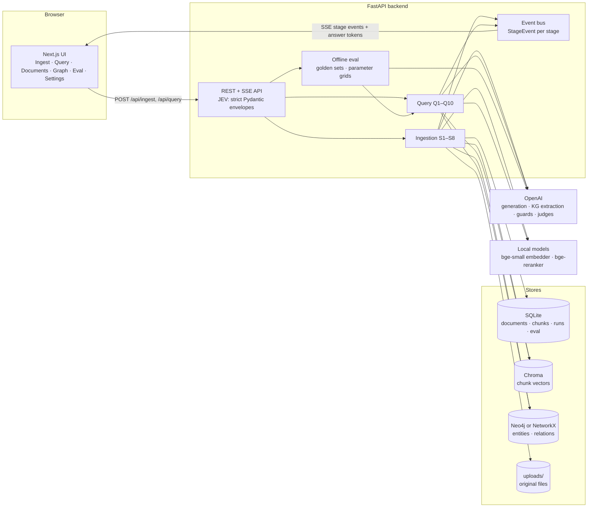

# RAGScope

*Hybrid vector + knowledge-graph RAG, with every stage visible, guarded and measured.*

A transparent hybrid RAG system: a Chroma vector store plus a knowledge graph (entity vertices and relation edges), with strict JSON input validation, input and output guardrails, evaluation, and a web UI that shows every pipeline stage live, with tunable parameters.

> **Hybrid RAG, not Microsoft GraphRAG.** Retrieval combines vector search with a knowledge graph built from LLM-extracted entities and relations, fused by weighted reciprocal-rank fusion. It does not implement Microsoft GraphRAG's community detection and community summaries.

## Quick start (Docker)

Requirements: Docker Desktop and an OpenAI API key.

```bash
cp .env.example .env          # then set OPENAI_API_KEY in .env
docker compose up --build
```

| Service  | URL                    | Notes |
|----------|------------------------|-------|
| UI       | http://localhost:3000  | production build of the Next.js app |
| API      | http://localhost:8010  | FastAPI; interactive docs at `/docs` |
| Neo4j    | http://localhost:7474  | user `neo4j`, password `NEO4J_PASSWORD` (default `graphrag-dev`) |

The first start downloads the embedding model (bge-small, about 130 MB) and, on the first query, the re-ranker (bge-reranker-base, about 1.1 GB) into the `model-cache` volume.

Try it with the sample data:

1. **Ingest:** upload the four files in [`samples/docs/`](samples/docs) and watch S1–S8 run.
2. **Query:** ask, for example, "When does Northwind fit microinverters instead of a string inverter?"
3. **Graph:** browse the extracted entities (people, products, companies) and their source chunks.
4. **Eval:** upload [`samples/golden_set.jsonl`](samples/golden_set.jsonl) and run it, optionally over a grid such as `top_n = 2, 4` or `chunk_size = 256, 512`.

The backend container runs in development mode: `./backend` is bind-mounted and Uvicorn reloads on change. The frontend container is a production build; for frontend development, run it on the host (below).

## Architecture



### Ingestion pipeline

| Stage | What it does |
|-------|--------------|
| S1 Upload | Extension whitelist, magic-byte check, SHA-256; re-uploads with the same chunk settings are skipped; the original file is kept in `uploads/` |
| S2 Parse & clean | pypdf / python-docx / Markdown / text; repeated headers and footers removed |
| S3 Tokenize | tiktoken (`cl100k_base` by default) |
| S4 Chunk | Token windows (`chunk_size`, `chunk_overlap`) that prefer paragraph and sentence boundaries |
| S5 Embed | bge-small-en-v1.5, L2-normalised |
| S6 Dedup & cluster | Near-duplicates above `dedup_threshold` link to a canonical chunk; seeded k-means topic clusters with LLM labels |
| S7 Vector store | Chroma upsert; previous versions of re-chunked documents are replaced |
| S8 Knowledge graph | One LLM extraction call per new unique chunk; entities and relations keep provenance to chunks |

### Query pipeline

| Stage | What it does |
|-------|--------------|
| Q1 Validate | The request envelope (validated by the API before the run starts) |
| Q2 Input guardrail | Length, prompt injection (rules + LLM classifier), PII masking (Presidio + Aadhaar/PAN), toxicity, off-topic |
| Q3 Embed | Query embedding |
| Q4 Vector retrieval | `top_k` candidates, duplicates collapsed, `similarity_threshold` applied |
| Q5 Graph retrieval | Query entities (LLM) matched to vertices, expanded `graph_hops`; evidence chunks from provenance |
| Q6 Fusion | Weighted RRF of vector and graph candidates (`hybrid_weight_vector`) |
| Q7 Re-rank | Cross-encoder bge-reranker-base, keeps `top_n` |
| Q8 Generate | Streams the answer with `[chunk_id]` citations |
| Q9 Output guardrail | Citation check, groundedness judge (one regeneration, then a safe fallback), PII leak, no-answer handling, format |
| Q10 Online eval | Faithfulness, answer relevancy, context precision, per-stage latency and token usage, after the answer is shown |

### Evaluation

- **Golden sets:** upload JSONL with `{"question", "ground_truth", "relevant_chunk_ids"?}`, or generate a seeded synthetic set from your chunks. Relevant chunk ids are stored as text spans, so they keep matching after re-ingestion and across chunk sizes.
- **Metrics:**
  - LLM judges: faithfulness, context precision, context recall and answer correctness
  - embedding cosine: answer relevancy
  - span overlap: hit rate@top_n and MRR
- **Grids:** any query parameter, plus `chunk_size`. Cells with a `chunk_size` query a throwaway index rebuilt from the kept originals in `data/eval_indexes/`. These are cached and can be deleted on the Eval page. Your live index is never touched.
- **Cost:** before a run, the Eval page shows the worst-case number of LLM calls, including index builds.

## Configuration

All settings come from environment variables; see [`.env.example`](.env.example). API keys are read only from the environment, never from the UI.

- **LLM:** only the OpenAI adapter is implemented (`OPENAI_MODEL`, `OPENAI_MODEL_FAST`). `OPENAI_BASE_URL` can point it at an OpenAI-compatible gateway; this is untested with other servers.
- **Graph store:** Neo4j when `NEO4J_URI` is set, otherwise NetworkX persisted to JSON. Docker Compose sets it to its `neo4j` service; put `NEO4J_URI=` (empty) in `.env` to use NetworkX instead.
- **Pipeline defaults and guardrails:** edit them on the Settings page (saved to `data/runtime_config.json`). The Parameters panel on Ingest and Query overrides them per browser.

## Development

The backend runs and is tested in Docker. On this project's Windows machine, Smart App Control blocks several compiled Python packages on the host.

```bash
docker compose run --rm --no-deps backend python -m pytest -q          # backend tests
docker compose run --rm --no-deps backend sh -c "python -m ruff check app tests && python -m ruff format --check app tests"

cd frontend
npm install
NEXT_PUBLIC_API_URL=http://localhost:8010 npm run dev   # UI on :3000 against the Docker backend
npm test && npm run lint && npm run typecheck
npm run gen:schemas                                     # regenerate zod schemas from backend models
```

In PowerShell, set the variable first: `$env:NEXT_PUBLIC_API_URL="http://localhost:8010"; npm run dev`.

A [`Makefile`](Makefile) wraps the same commands (`make up`, `make test`, `make lint`, `make test-neo4j`, `make samples`).

Neo4j store tests need a running Neo4j:

```bash
docker compose up -d neo4j
docker compose run --rm -e NEO4J_TEST_URI=bolt://neo4j:7687 -e NEO4J_TEST_PASSWORD=graphrag-dev backend python -m pytest -q
```

### API

| Method | Path | Purpose |
|--------|------|---------|
| POST | `/api/ingest` | multipart upload → `{job_id}`; `GET /api/ingest/{job_id}/events` streams S1–S8 |
| POST | `/api/query` | `{query, params?, filters?}` → `{run_id}`; `GET /api/query/{run_id}/events` streams Q1–Q10 and tokens |
| GET, DELETE | `/api/documents`, `/api/documents/{id}` | documents; delete removes vectors, graph provenance and the kept original |
| GET | `/api/chunks`, `/api/chunks/{id}`, `/api/clusters` | chunk browser |
| GET | `/api/graph` | graph neighbourhood or overview |
| GET | `/api/runs` | ingest and query history |
| GET, PUT | `/api/config` | pipeline defaults, guardrails, online evaluation |
| GET, POST | `/api/eval/datasets`, `/api/eval/datasets/synthetic` | golden sets |
| POST | `/api/eval/estimate`, `/api/eval/runs` | price and start an eval run (`{dataset_id, param_grid}`) |
| GET | `/api/eval/runs/{id}?cell=`, `/api/eval/results/{id}` | metrics per cell, per-question drill-down |
| GET, DELETE | `/api/eval/indexes` | throwaway chunk_size indexes |
| GET | `/api/schema/{model}` | JSON Schema for client-side validation |
| GET | `/api/health` | component status |

## Known limits

- **Re-ranker latency.** On CPU, bge-reranker-base takes several seconds for 10–20 candidates, over the spec's 4 s p95 query budget. It scores only the first 256 tokens per chunk to help. A GPU or a smaller re-ranker would close the gap.
- **Reproducibility of LLM steps.** Retrieval order is deterministic for a given seed, parameters and corpus. LLM outputs (query entities, classifier scores, judges) use the seed where the provider supports it and are cached per input to keep repeat runs stable.
- **Cancelling an eval** takes effect between questions; an index build in progress runs to completion.
- **Eval runs** execute one at a time; ingest and document delete are refused (409) while one runs.
